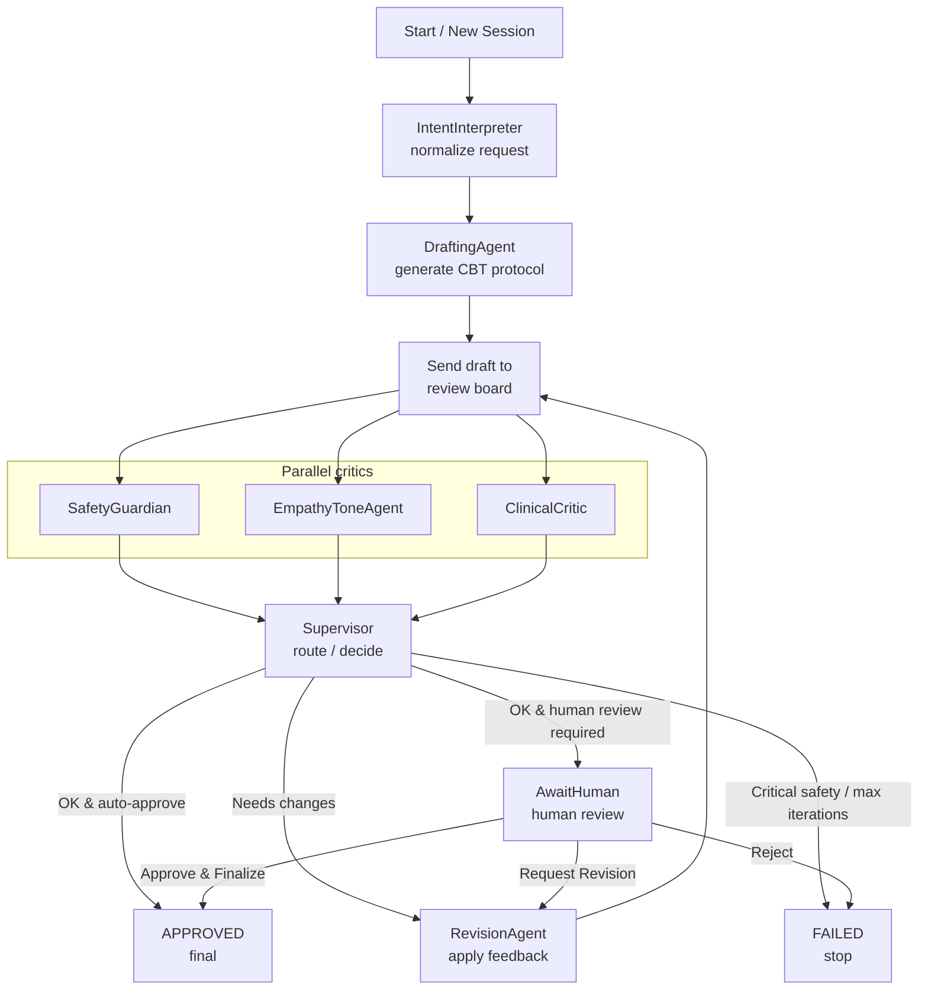

# 🧠 Cerina Protocol Foundry


> **An Agentic Architect for Evidence-Based Clinical Protocols**

Cerina Protocol Foundry is an intelligent multi-agent system that autonomously drafts, critiques, and refines Cognitive Behavioral Therapy (CBT) exercises and protocols. A team of specialized AI agents collaborate to ensure every protocol is:

- clinically sound  
- empathetic in tone  
- safe from a risk / pacing perspective  

**before** it is handed to a human clinician for final approval.

---

## 🖼️ Visual Tour

> Replace these placeholders with real screenshots from your UI.

### 1. Dashboard – Session Overview

*A centralized hub for starting and inspecting protocol design sessions.*

  
<sub>_Suggested: `/sessions` page showing “Start New Protocol Design” and Recent Sessions._</sub>

---

### 2. Agent Board – Multi-Agent Review Panel

*Real-time visibility into how specialized agents assess the current draft.*

  
<sub>_Suggested: Session Detail page with Safety, Empathy, and Clinical cards on the right._</sub>

---

### 3. Human-in-the-Loop Review

*Where clinicians make the final call.*

  
<sub>_Suggested: “AWAITING_HUMAN” state with protocol draft, metrics, and action buttons._</sub>

---

## 🏗️ Architecture & Optimization

The system follows a **Supervisor–Worker** topology:

- **Workers (agents)** perform focused tasks: drafting, reviewing safety, tone, and clinical quality, applying revisions.  
- The **Supervisor** decides whether:
  - the draft is ready for human review,
  - another revision cycle is needed, or
  - the session must be marked as `FAILED`.

### Agent Roles at a Glance

| Agent                | Responsibility                                           |
|----------------------|---------------------------------------------------------|
| **IntentInterpreter**| Normalize user request & extract target condition       |
| **DraftingAgent**    | Produce a concise, structured CBT protocol draft        |
| **SafetyGuardian**   | Check for risk, pacing issues, and safety guidance      |
| **EmpathyToneAgent** | Evaluate warmth, validation, and therapeutic tone       |
| **ClinicalCritic**   | Assess CBT validity, structure, and adherence to best practices |
| **RevisionAgent**    | Apply feedback from all critics and refine the draft    |
| **Supervisor**       | Route between critics, revisions, human review, or failure |

---

### Evolution: From Sequential to Parallel Critics

**Initial design:**  
All critic agents ran **sequentially**, one after another:

```text
Drafting → SafetyGuardian → EmpathyToneAgent → ClinicalCritic → Supervisor
```

- Simple and easy to debug.  
- But **total latency** was the sum of all critic calls.

**Optimized design:**  
To improve speed by a large factor, critics now run **in parallel** in a fan-out / fan-in pattern:

```text
           ┌─→ SafetyGuardian ──┐
Drafting ──┼─→ EmpathyToneAgent ├─→ Supervisor
           └─→ ClinicalCritic ──┘
```

- Latency is now effectively bounded by the **slowest** critic, not all three combined.  
- Achieved using LangGraph’s parallel branches and a custom reducer for `reviews` so each critic can safely append its own `Review` object without overwriting others.

In practice, this cut the critique phase from “X + Y + Z” seconds down to roughly `max(X, Y, Z)`.

---

### Agent Topology (Mermaid)



---

## ✨ Key Features

### 🤖 Multi-Agent Orchestration

- **Drafting Agent** – Generates the initial CBT protocol with:
  - Summary  
  - Core CBT steps  
  - Optional exposure hierarchy  
  - Homework  
- **Safety Guardian** – Flags unsafe pacing, missing crisis resources, or risky instructions.  
- **Empathy Agent** – Ensures language is validating, non-judgmental, and alliance-building.  
- **Clinical Critic** – Checks adherence to CBT principles (e.g., graded exposure, cognitive restructuring, behavioral activation as appropriate).

Each critic returns:

- a **numeric score** (0–1)  
- a short **summary**  
- a structured **rationale**

### ⚡ Parallel Execution

- Safety, Empathy, and Clinical agents run concurrently for each draft.  
- Custom `reviews` reducer in LangGraph merges per-agent feedback safely.  
- The Supervisor sees a single unified state and can make decisions quickly.

### 👨‍⚕️ Human-in-the-Loop (HITL)

- The graph halts in an `AWAITING_HUMAN` state once thresholds are met.  
- Dashboard shows:
  - scores,
  - agent rationales, and
  - the editable protocol draft.  
- Human actions:
  - **Request Revision**  
  - **Approve & Continue Agents**  
  - **Approve & Finalize**  
  - (Optional) **Reject**

### 💾 Persistence & Time-Travel

- Uses SQLite checkpointers (via LangGraph) to persist graph state.  
- Sessions can be paused, resumed, and safely inspected after the fact.  
- Agent runs are logged with:
  - input snapshot,
  - output snapshot,
  - duration, and
  - error (if any).

### 🔌 MCP Integration

- Implements the **Model Context Protocol**, exposing Cerina as a tool.  
- MCP clients (e.g. Claude Desktop) can:
  - start protocol generation,
  - choose between **human-review** mode and **auto-approve** mode,
  - receive structured protocol output and scores.

---

## 🚀 Getting Started

### Prerequisites

- Python 3.11+  
- Node.js & npm  
- Access to an LLM API (e.g. Google Gemini; optionally Groq/Llama)

---

### 1. Backend Setup (The Brain)

```bash
cd backend

# Create and activate a virtual environment
python -m venv venv
# Windows
venv\Scriptsctivate
# macOS / Linux
source venv/bin/activate

# Install dependencies
pip install -r requirements.txt
```

Create a `.env` file (or edit the existing one):

```env
GEMINI_API_KEY=your_api_key_here
# add any other required settings
```

Run the FastAPI server:

```bash
# Windows (PowerShell)
$env:PYTHONPATH="src"; uvicorn cerina.api:app --reload

# macOS / Linux
PYTHONPATH=src uvicorn cerina.api:app --reload
```

Backend will be available at: **http://127.0.0.1:8000**

---

### 2. Frontend Setup (The Interface)

```bash
cd frontend

npm install
npm run dev
```

Dashboard will be available at: **http://localhost:5173/sessions**

---

### 3. MCP Server (Optional)

If you’re using the MCP integration:

```bash
cd mcp_server
python -m mcp_server  # or the appropriate entrypoint
```

Configure your MCP client to connect to this server and expose the Cerina tool.

---

## 🧪 Usage Guide

### Method A – Web Dashboard

1. Open **http://localhost:5173/sessions**.  
2. Click **“Start New Protocol Design”**.  
3. Enter:
   - Intent (e.g. _“Create a CBT exposure hierarchy for fear of elevators”_)  
   - Optional clinical context.  
4. The system runs:
   - IntentInterpreter → Drafting → **Parallel critics** → Supervisor.  
5. When status becomes `AWAITING_HUMAN`:
   - Review the draft and agent feedback.  
   - Optionally edit the protocol text.  
   - Choose:
     - **Request Revision** – agents revise and re-review.  
     - **Approve & Continue Agents** – accept edits, let agents do one more check, then auto-approve.  
     - **Approve & Finalize** – mark the protocol as final.

### Method B – MCP / External AI Client

1. Configure your MCP client (e.g. Claude Desktop) to use the Cerina MCP server.  
2. Call the tool with:
   - `prompt` or `intent`,  
   - optional `context`,  
   - `auto_approve` flag.  
3. The client receives:
   - final protocol text,  
   - safety/empathy/clinical scores,  
   - final status (`APPROVED` or `FAILED`).

For quick testing you can also run a local test script (if provided):

```bash
python mcp_server/test_client.py
```

---

## 📂 Project Structure

```text
cerina-protocol-foundry/
├── backend/
│   ├── src/cerina/
│   │   ├── agents/         # Specialized agents (Safety, Clinical, Empathy, etc.)
│   │   ├── graph.py        # LangGraph workflow & parallel logic
│   │   ├── api.py          # FastAPI endpoints (sessions, human actions)
│   │   └── state.py        # Shared state models (FoundryState, Review, Draft)
│   └── cerina_graph.db     # SQLite persistence & checkpoints
│
├── frontend/
│   ├── src/
│   │   ├── components/ui/  # Reusable UI components (Cards, Badges, Buttons)
│   │   ├── pages/          # Session list & detail views
│   │   └── api/            # API client hooks & data fetching
│
└── mcp_server/             # Model Context Protocol server & tooling
```

---

## 🛠️ Tech Stack

**Backend**

- Python, FastAPI  
- LangGraph (stateful multi-agent orchestration)  
- SQLite + SQLAlchemy  
- LLM client: Google Gemini (and optionally Groq / Llama 3.1)

**Frontend**

- React, TypeScript  
- Tailwind CSS  
- TanStack Query for data fetching  
- Recharts for optional dashboards / stats visualizations  

**MCP**

- Model Context Protocol server exposing Cerina as a tool  
- Allows external AI clients to call the full workflow as a single tool

---

## 💡 Design Goals & Trade-offs

- **Explicit Agent Boundaries**  
  Each agent has a single responsibility (intent, drafting, safety, tone, clinical review, revision) to keep prompts small and behavior interpretable.

- **Communication First**  
  Agents communicate through a shared structured state (`FoundryState`, `Review`, `Draft`) rather than free-form chat, which reduces ambiguity and simplifies debugging.

- **Fail Fast, Fail Loud**  
  Catastrophic safety issues or repeated low scores after `max_iterations` cause the Supervisor to mark the session as `FAILED` with a clear error reason.

- **Human-in-the-Loop by Default**  
  Dashboard flows always halt at `AWAITING_HUMAN` once quality thresholds are met; MCP flows can opt into `auto_approve` when appropriate.

- **Performance-Aware**  
  The transition from sequential to parallel critics is a deliberate optimization to keep the system practical even as prompts become richer.

---

## 📸 Screenshot Snippets (Optional)

Update these sections with real images in your repo:

```markdown
<!-- Home / New Session form -->


<!-- Session Detail with draft + agent board -->


<!-- Stats card / charts -->

```


---

*Built with ❤️ to explore safer, more interpretable AI support for mental health workflows.*
